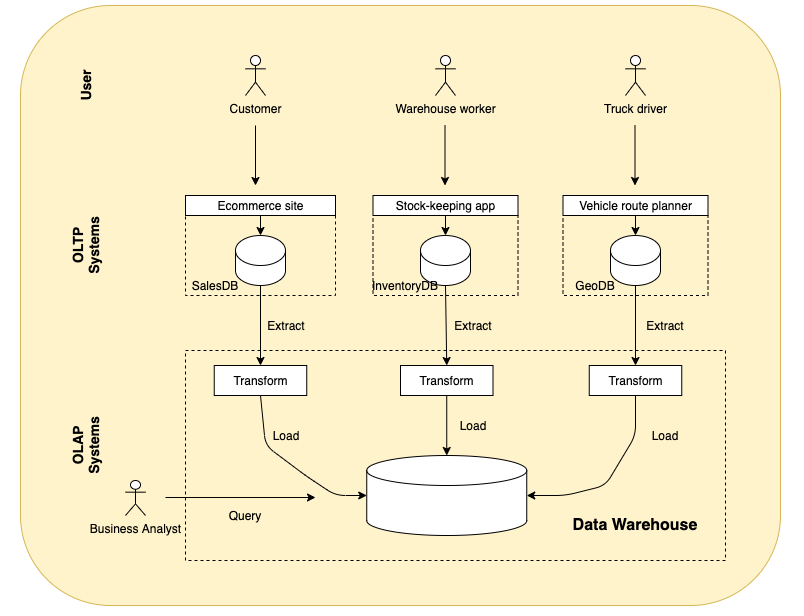

During my first job, I was looking at the organization's technical architecture. And saw that we had multiple databases set up. We had MySQL databases, Hive and Hadoop. From the surface, they all seem the same to me. As a user, you would enter the SQL language to access the data. I wondered why we didn't just use MySQL database for everything. Why go through all the trouble of setting up Hive and Hadoop.
After digging deeper, I started to understand the difference between traditional databases ( MySQL ) and data warehouses ( Hive + Hadoop )and the concept of OLTP and OLAP. Here I would like to elaborate on my learnings. 

## What is a Database 
On the most fundamental level, a database needs to do two things:
1. when you give it some data, it should store data   
2. when you ask it again, it should give the data back to you.    

In the beginning, databases started being used for many different kinds of data - what products have been bought, a money transaction, a click on your website, etc. - the basic access pattern remained similar to processing business transactions. An application typically looks up a small number of records by some key. Records are inserted or updated based on the user's/application input. Because these applications are interactive, the access patterns became known as OnLine Transaction Processing (OLTP).
However, databases also started being increasingly used for data analytics, which has very different access patterns. Usually, an analytic query needs to scan over a huge number of records, only reading a few columns per record, and calculates aggregate statistics ( such as count, sum, or average ) rather than returning the raw data to the user. For example, if your data is a table of member interactions with your email, then analytic queries might be
1. What was the total number of customers that clicked on our email?
2. Out of the users who clicked on our email, how many of them bought our product in the past 60 days?

In order to differentiate this pattern of using databases from transaction processing, it has been called OnLine Analytic Processing (OLAP).
At first, the same databases were used for both transaction processing and analytic queries. That worked fine when you're dealing with small amounts of data. However, if you're working with terabytes/petabytes of data and joining on multiple tables, this could take up a lot of computing resources and time. Since OLTP systems are usually expected to be highly available and to process transactions with low latency because they are often critical to the operations of the business. Organizations created a new database system for analytics queries that are expensive, scans large parts of the dataset. This separate database was called a data warehouse.

## What is a Data Warehouse
A data warehouse, by contrast, is a separate database that analysts can query however they want, without affecting OLTP operations. The data warehouse contains a read-only copy of the data in all various OLTP systems in the company. Data is extracted from OLTP, transformed into an analysis-friendly schema, cleaned up, and then loaded into the data warehouse. This process of getting data into the warehouse is known as Extract-Transform-Load (ETL) and is illustrated below




In the above diagram, records are inserted into OLTP databases by the user/application. They are then run on a batch or streaming basis and imported into OLAP databases. When imported into data warehouse, the data is also transformed to the suitable schema, which is often times dimensional modeling.
In our example given at the beginning of the article, Website/users would insert records into MySQL (OLTP database). Then the records in MySQL would be extracted, transformed and loaded into Hive + Hadoop (OLAP database).
A big advantage of using a separate data warehouse, rather than querying OLTP systems directly for analytics, is that the data warehouse can be optimized for analytic access patterns. So what are the different techniques used to optimize OLAP?

## How does Data Warehouse optimize for analytical queries

Due to the difference in access patterns, OLTP and OLAP have different implementations that optimize for their use cases. Here I will talk about how OLAP systems are optimized for analytics:
There are three common methods used.
1. Schema for Analytics   
2. Column Oriented Storage   
3. Column Compression   

### Schema for Analytics

In OLTP, a wide range of data models are used depending on the need of the application or the preferences of developers. Data can be represented by JSON/XML/relations/graph data. In comparison, the data model of a data warehouse is most commonly relational; data are represented by unordered collection of tuples ( i.e. rows in SQL). Because SQL is generally a good fit for analytics queries. There are many graphical data analysis tools that generate SQL queries, visualize the results, and allow analysts to explore the data. 
Based on the relational model, many data warehouses structure the tables in a way called dimensional modeling. Dimensional Modeling is a data structure technique optimized for data storage in a Data warehouse. The purpose of dimensional modeling is to optimize the database for faster retrieval of data. The most commonly used methods are the star schema and snowflake schema. I will not go too much in depth into this topic, but I recommend reading Intro to Dimensional Modeling and Star schema vs Snowflake schema.

### Column Oriented Storage

Next, I'll talk about how to store data in an efficient manner that can optimize for the query patterns of data warehouses. For example, say you run the below command

```sql
select * from ninjas
```

And this is the result returned to you.

|     | Ninja_Name | Gender      | Village | ... |
| ----------- | ----------- | ----------- | ----------- | ----------- |
|    Row0   | Morris       | Male      | MomoLand       | ... |
|    Row1   | Naruto        | Male   |  HiddenLeaf      | ... |


At the surface, you enter a SQL query and you get a nice table of results. Underlyingly, the query is transformed by the database storage engine to access the data that is stored on the actual hard disk. How data is stored on disk differs system by system. In most OLTP databases, storage is laid out in a row-oriented fashion on disk; all the values from one row of a table are stored next to each other. Below is an example of data stored on disk in row layout:

|    Block1   | Block2       |
| ----------- | ----------- | 
|  Morris,Male,MomoLand,... | Naruto,Male,HiddenLeaf,... |

This storage works well when your access patterns are a small number of records per query. It can provide low-latency writes from user input. However, this is not suitable for aggregation queries when you only select a number of columns but are scanning a large number of rows.
Say you wanted to get the distinct villages in your population, you would enter the below query

```sql
select Ninja_Name, Village from ninjas group by Village
```
Doing this with row-oriented storage, we will need to load the entire row of data into memory then pull out the relevant data. In the above example, you would need to load (ninja_name, gender, village … ) and only read the Village column. Then you would do this for every record in the table to do the aggregation. This is a waste of computing resources.
Data warehouses were created to solve this problem. A typical data warehouse query only accesses a limited number of columns and ignores the rest of the columns. Hence, instead of storing all values from one row together, you could store all the values from each column together instead. This is known as column-oriented storage.

|    Block1   | Block2       |Block3       |
| ----------- | ----------- | ----------- | 
|  Morris,Naruto | Male,Male | MomoLand,HiddenLeaf |


When you rerun the above query that selects distinct villages in your population, you only need to load the column Village into memory, which is Block3 in the above table.

### Column Compression

Besides only loading these columns from disk that are required for a query, we can further reduce the demands on disk throughput by compressing data. By compressing the data before storing it on disk, you save storage space. And when reading the data, you only decompress the columns needed for the query. Some common methods used for compression are zlib, Snappy, dictionary encoding, bit packing, delta encoding, and run-length encoding.

### ORC File Format
Let's give an example of a file format that optimizes for OLAP. This diagram illustrates the ORC file structure:


ORC file format combines column-wise and row-wise storage to improve performance.
An ORC file contains groups of row data called stripes. The above diagram has 3 stripes. Within each stripe, it uses column-wise storage. The file footer contains a list of stripes in the file, the number of rows per stripe, and each column's data type. It also contains column-level aggregates count, min, max, and sum.
The default stripe size is 250 MB. Large stripe sizes enable large, efficient reads from HDFS.
For each column within stripes, it utilizes block-mode compression based on data type. Run-length encoding is used for integer columns and dictionary encoding for string columns
Now let's see how this works in action. Say you use the below query
```sql
select * from ninjas where Village= 'HiddenLeaf'
```

For each stripe, ORC files will only decompress the ```Village``` column and will check if the column value matchs ```HiddenLeaf```, if it matches, then other columns are decompressed to fetch the entire row. This is also referred to as lazy decompression. 

On top of that, ORC provides additional optimization. In each file footer, it stores metadata about each stripe and it's columns. For instance, it stores the min, max value of each column in each stripe. If the desired column value isn't in the range of the column value, ORC can directly skip the stripe without having to decompress the column to check. To understand more,  [Here](https://orc.apache.org/specification/ORCv1/) is a detailed explanation of the ORC file format. 


## Final Thoughts
To conclude, OLTP is used by end-user/customer via web applications and OLAP is used by a business analyst for making decisions. Due to it's use cases, OLAP systems uses dimensional modeling, column-oriented storage and compression methods to optimize for performance. This is a short summary of why anyone should use data warehouses and how do Data warehouses optimize for OLAP analysis. If you want to understand more, I highly recommend reading *Designing Data-Intensive Applications*. 

*Thank you Jinnie and Ved for reading drafts of this.*

## Reference
- [Designing Data-Intensive Applications](https://www.amazon.com/Designing-Data-Intensive-Applications-Reliable-Maintainable/dp/1449373321)
- https://stackoverflow.com/questions/42416236/what-is-the-difference-between-inputformat-outputformat-stored-as-in-hive

